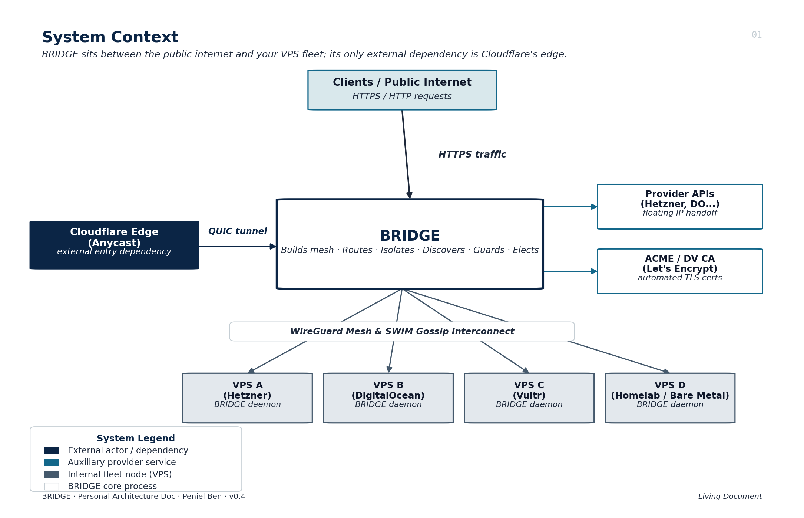
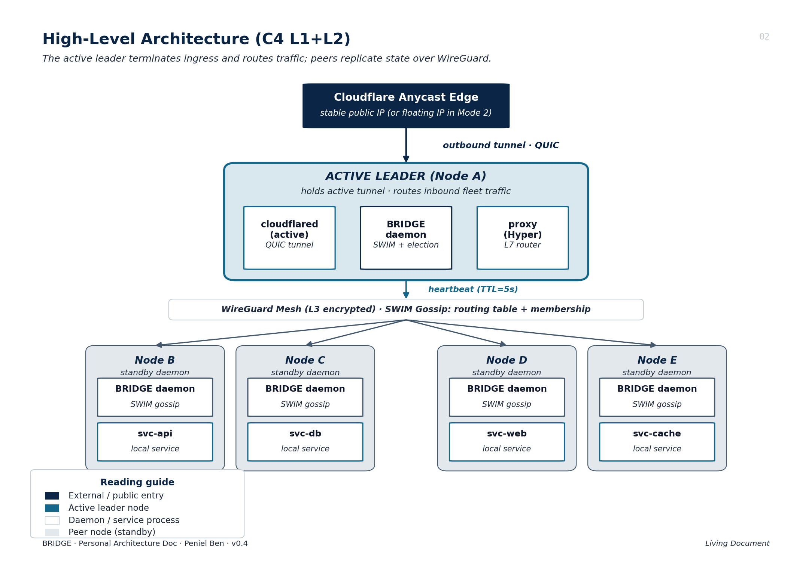
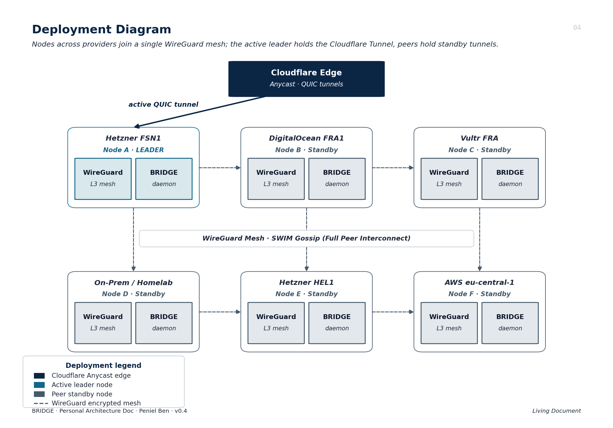

# Bridge

Bridge is a distributed Rust-based edge routing and service-orchestration platform for multi-node VPS fleets. It combines encrypted mesh networking, cluster coordination, and traffic routing so services can stay available during node failures.

## What Bridge Does

- Maintains a fleet-wide domain routing registry (`domain -> node`).
- Routes traffic in multiple proxy modes (Direct, Handoff, Managed).
- Uses WireGuard mesh networking for secure node-to-node communication.
- Uses SWIM-style gossip and leader coordination for cluster health.
- Supports failover replication/failback workflows for service continuity.
- Exposes local control via CLI + Unix socket IPC.
- Provides a real-time dashboard for cluster and route observability.

## High-Level Architecture





## Proxy Modes

Bridge supports three routing models:

1. **Direct Mode (L7):** Bridge terminates TLS and reverse-proxies HTTP traffic.
2. **Handoff Mode (L4):** Bridge extracts SNI and transparently forwards TCP streams without TLS termination.
3. **Managed Mode (Control Plane):** Bridge updates local proxy routing config; Bridge is not in the hot path.


## Core Workings

1. **Ingress & Route Selection**  
   Incoming traffic is mapped to a target node/service from Bridge's routing registry.
2. **Mesh Transport**  
   Inter-node traffic is carried over a WireGuard-backed mesh network.
3. **Cluster Coordination**  
   Nodes exchange membership and health information; leadership drives cluster-level decisions.
4. **Failure Handling**  
   On failure, Bridge can trigger workload duplication and later failback to origin nodes.
5. **Observability & Control**  
   Operators can inspect status, routes, cluster state, and replicas via CLI/dashboard.

## Project Layout

- `src/` - main daemon, CLI, IPC, dashboard, failover logic.
- `cluster/`, `mesh/`, `proxy/`, `registry/` - core workspace crates.
- `examples/` - sample configs (including demo scenarios).
- `docs/` - architecture and presentation documentation.
- `tests/` - integration and behavior tests.

## Usage

### 1. Build

```bash
cargo build --release
```

### 2. Run Bridge daemon

```bash
cargo run -- --config bridge.toml
```

### 3. Common CLI operations

```bash
# Daemon health/status
target/debug/bridge ping
target/debug/bridge status

# Route and cluster inspection
target/debug/bridge routes
target/debug/bridge cluster
target/debug/bridge inspect app.example.com --client-ip 192.168.1.100

# Failover demo actions
target/debug/bridge replicate --node-id vm-02
target/debug/bridge replicas
target/debug/bridge failback api.example.com
```

### 4. Run tests

```bash
cargo test
```

## Demo Dashboard

When enabled in config, Bridge serves a local dashboard (for example `http://127.0.0.1:9090`) to visualize cluster nodes, routes, and active replicas in real time.



## Additional Documentation

- Proxy architecture: `docs/PROXY_ARCHITECTURE.md`
- Presentation runbook: `docs/PRESENTATION_RUNBOOK.md`
