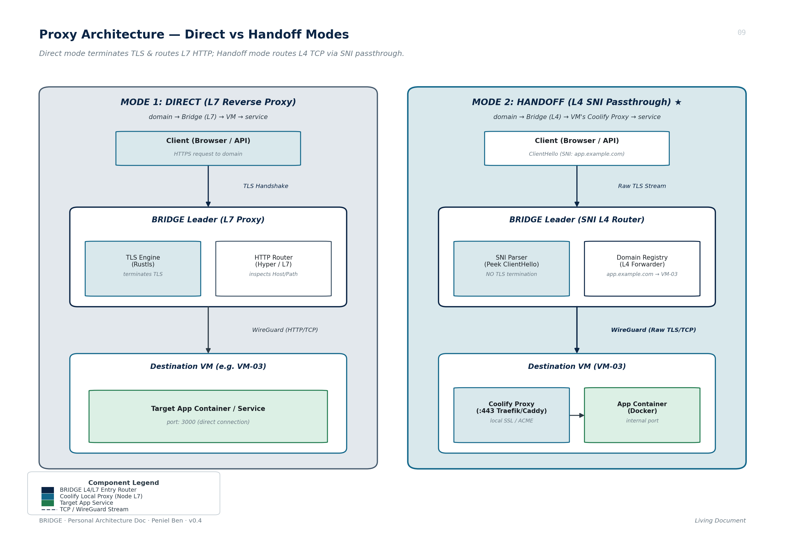
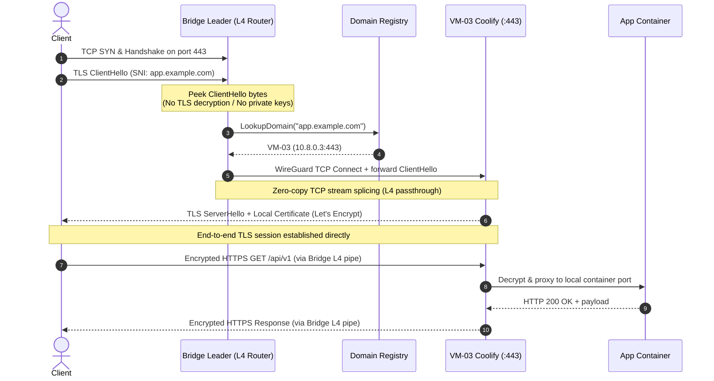
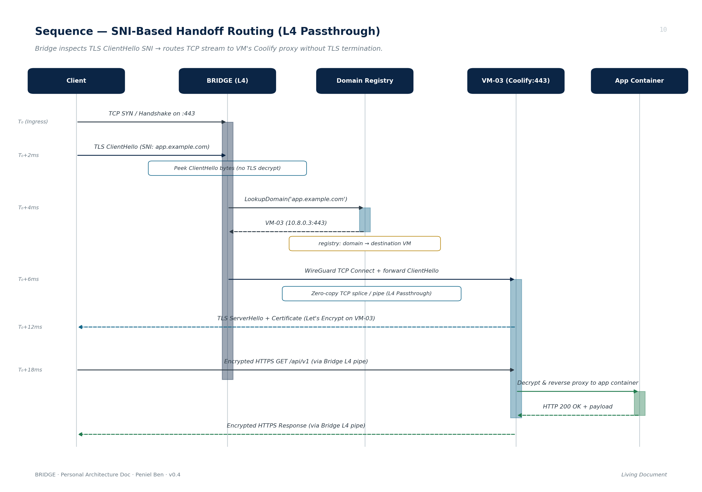
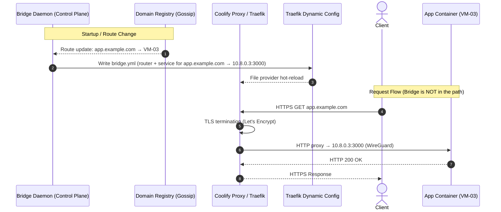
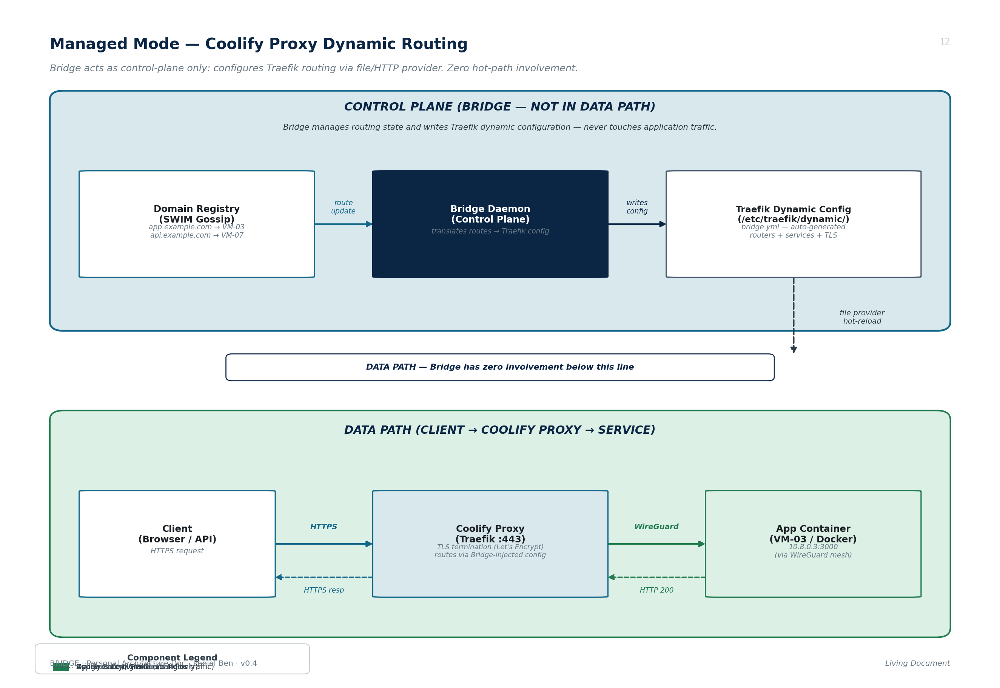
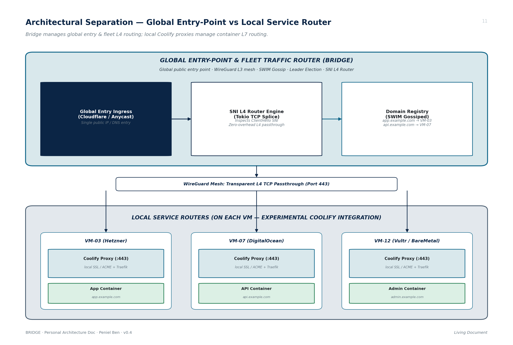

# BRIDGE Proxy Architecture & Routing Modes

> **Document Version:** 0.4 — Living Document  
> **Component:** `bridge-proxy` (Rust / Tokio / WireGuard Mesh)  
> **Status:** Active Research & Implementation Specification

---

## 1. Overview & Architectural Philosophy

Bridge is designed as a distributed, fault-tolerant ingress routing mesh across multi-cloud VPS fleets (Hetzner, DigitalOcean, Vultr, AWS, bare-metal). 

At the proxy layer, Bridge solves multi-server domain routing without creating a single point of failure (SPOF) while coexisting seamlessly with existing node-level deployment platforms like **Coolify**, **Traefik**, and **Nginx**.

Bridge provides three distinct operation modes:

```
MODE 1 (Direct):   Client ──────► Bridge (L7) ─────────────────────────► VM ──────────────► service
MODE 2 (Handoff):  Client ──────► Bridge (L4 SNI Router) ──────────────► VM's Coolify ───► service
                                   [Zero TLS Termination / Passthrough]    [Local L7 Proxy]
MODE 3 (Managed):  Bridge ──────► configures Coolify Proxy (Traefik)
                   Client ──────► Coolify Proxy ────────────────────────────────────────────► service
                                   [Bridge is control-plane only — zero hot-path involvement]
```



---

## 2. Proxy Modes Specification

### 2.1 Mode 1 — Direct Mode (L7 Reverse Proxy)

* **Data Path:** `domain → Bridge → VM → service`
* **OSI Layer:** Layer 7 (Application / HTTP)
* **TLS Handling:** Bridge **terminates TLS** using `rustls` and provisions certificates automatically via ACME RFC 8555 (`instant-acme`).
* **Routing Logic:** Bridge parses inbound HTTP/1.1 and HTTP/2 requests, inspects HTTP `Host` headers, request paths, and headers, and executes reverse proxy forwarding directly to backend container ports across the WireGuard mesh (e.g. `10.8.0.3:3000`).
* **Use Case:** Bare VPS fleets running standalone Docker containers or native systemd services without local reverse proxies.

---

### 2.2 Mode 2 — Handoff Mode (SNI-Based L4 Passthrough Router) ★ *Default & Experimental*

* **Data Path:** `domain → Bridge → VM's Coolify proxy → service`
* **OSI Layer:** Layer 4 (Transport / TCP Stream Router)
* **TLS Handling:** **Zero TLS Termination.** Bridge does not hold private keys or SSL certificates for customer domains. TLS is terminated end-to-end at the destination VM's Coolify proxy.
* **HTTP Handling:** Bridge does not parse, modify, or buffer HTTP payloads.

#### Handoff Mode Mechanics
1. **TLS ClientHello Peek / SNI Extraction:** When a client initiates a TLS connection to port 443, Bridge inspects the initial bytes of the TLS handshake record without completing the handshake, extracting the **Server Name Indication (SNI)** hostname (e.g., `app.example.com`).
2. **Domain Registry Lookup:** Bridge performs an $O(1)$ lock-free lookup in its local Domain Registry table (e.g., `app.example.com → VM-03`).
3. **Transparent L4 Forwarding (TCP Stream Passthrough):** Bridge opens a TCP connection over the encrypted WireGuard mesh to `VM-03:443` and transparently splices bidirectional TCP traffic (via zero-copy `tokio::io::copy_bidirectional`).
4. **Local Coolify Proxy Routing:** `VM-03`'s local Coolify proxy (Traefik / Caddy / Nginx) terminates TLS using its locally managed Let's Encrypt certificates, matches its internal Docker routing labels, and reverse-proxies to the local application container.





---

### 2.3 Mode 3 — Managed Mode (Coolify Proxy Dynamic Routing)

* **Control Path:** `Bridge → Traefik Provider API → Coolify Proxy routing config`
* **Data Path:** `Client → Coolify Proxy (Traefik) → service`
* **Bridge on Hot Path:** **No.** Bridge does not bind listener ports, terminate TLS, or touch application traffic.
* **TLS Handling:** Entirely delegated to Coolify's Traefik instance (Let's Encrypt / local certificates).

#### Core Idea

In Direct and Handoff modes, Bridge sits in the request data path — it either terminates TLS (Direct) or splices TCP streams (Handoff). Managed mode takes a fundamentally different approach: Bridge **never touches application traffic**. Instead, it extends the routing configuration of the existing Coolify proxy (Traefik) running on each VM.

Coolify already deploys Traefik as its local reverse proxy, which discovers services via Docker labels and manages TLS certificates. The limitation is that Traefik only knows about containers on its local Docker host. For cross-node routing (e.g., `app.example.com` resolving to VM-01 but the service running on VM-03), Traefik has no native awareness.

Bridge closes this gap by acting as a **dynamic Traefik configuration provider**, injecting routers, services, and middleware that make Traefik route cross-node traffic over the WireGuard mesh — without Bridge ever being in the request path.

#### Managed Mode Mechanics

1. **Domain Registry as Source of Truth:** Bridge maintains its fleet-wide Domain Registry (`domain → VM`) via gossip, exactly as in other modes.
2. **Traefik Provider Integration:** On each VM, the local Bridge daemon translates Domain Registry entries into Traefik dynamic configuration and pushes them via Traefik's [file provider](https://doc.traefik.io/traefik/providers/file/) (writing YAML/TOML to a watched directory) or [HTTP provider](https://doc.traefik.io/traefik/providers/http/) (serving an endpoint that Traefik polls).
3. **Cross-Node Route Injection:** For a domain mapped to a remote VM, Bridge generates a Traefik service pointing to the remote VM's WireGuard IP (e.g., `http://10.8.0.3:3000`), allowing Traefik to proxy the request over the encrypted mesh.
4. **Local Routes Untouched:** Domains mapped to the local VM are already handled by Coolify's own Docker label discovery. Bridge skips these — no configuration conflict.

#### Example: Traefik Dynamic Configuration (Generated by Bridge)

```yaml
# Auto-generated by Bridge daemon — written to /etc/traefik/dynamic/bridge.yml
# Traefik watches this file via its file provider.

http:
  routers:
    bridge-app-example:
      rule: "Host(`app.example.com`)"
      service: bridge-app-example
      tls:
        certResolver: letsencrypt
      entryPoints:
        - websecure

  services:
    bridge-app-example:
      loadBalancer:
        servers:
          - url: "http://10.8.0.3:3000"    # VM-03 via WireGuard mesh
```

#### Sequence: Managed Mode Request Flow





#### Trade-offs vs. Handoff Mode

| Dimension | Handoff Mode | Managed Mode |
| :--- | :--- | :--- |
| **Bridge on hot path** | Yes (L4 TCP splicing) | No (control-plane only) |
| **Failure blast radius** | Bridge failure = traffic outage | Bridge failure = stale routes (Traefik keeps serving last-known config) |
| **Latency overhead** | Extra hop through Bridge + WireGuard | Direct to Traefik (single WireGuard hop for cross-node) |
| **TLS certificate management** | Destination VM's Coolify | Local Traefik (same VM that receives traffic) |
| **Complexity** | Bridge must handle TCP stream lifecycle | Bridge must integrate with Traefik's provider API |
| **Operational dependency** | Requires Bridge to be running and healthy for live traffic | Traefik operates independently once configured |

---

## 3. Architectural Separation of Concerns

Bridge and Coolify play complementary, strictly decoupled roles in the infrastructure stack:

| Dimension | Bridge (Global Traffic Router) | Coolify Proxy (Local Service Router) |
| :--- | :--- | :--- |
| **Scope** | Global fleet entry-point (Cross-node / Cross-provider) | Local single-node router (Intra-node) |
| **OSI Layer** | **Layer 4 (Transport / SNI Passthrough)** | **Layer 7 (Application / HTTP Reverse Proxy)** |
| **TLS / SSL** | Transparent passthrough (Does not hold domain certs) | Local TLS termination (Manages Let's Encrypt certs) |
| **Service Discovery**| Fleet-wide Domain Registry (`domain → VM`) gossiped via SWIM | Local Docker socket label scanning (`service → container`) |
| **Failover / HA** | High-availability leader election & tunnel handoff | Local container health checks & zero-downtime restarts |
| **Status** | Stable Core Routing Layer | Experimental Local Handoff Integration |

```
┌────────────────────────────────────────────────────────────────────────────────────────┐
│                   GLOBAL ENTRY-POINT & FLEET TRAFFIC ROUTER (BRIDGE)                   │
│  • Public Anycast / Cloudflare Tunnel / Floating IP Ingress                            │
│  • Leader Election & Failover Detection (SWIM Gossip)                                  │
│  • WireGuard Encrypted L3 Mesh Interconnect                                            │
│  • Zero-Overhead SNI-Based L4 Passthrough Router Engine                                │
│  • Fleet Domain Registry: app.example.com → VM-03, api.example.com → VM-07             │
└───────────────────────────────────────────┬────────────────────────────────────────────┘
                                            │
               WireGuard Mesh: Transparent L4 TCP Passthrough (:443)
                                            │
       ┌────────────────────────────────────┼────────────────────────────────────┐
       ▼                                    ▼                                    ▼
┌───────────────┐                    ┌───────────────┐                    ┌───────────────┐
│     VM-03     │                    │     VM-07     │                    │     VM-12     │
│ (Hetzner FSN) │                    │ (DigitalOcean)│                    │ (Vultr / Bare)│
│               │                    │               │                    │               │
│ Coolify Proxy │                    │ Coolify Proxy │                    │ Coolify Proxy │
│ (Traefik:443) │                    │ (Traefik:443) │                    │ (Traefik:443) │
│   │ local SSL │                    │   │ local SSL │                    │   │ local SSL │
│   ▼           │                    │   ▼           │                    │   ▼           │
│ App Container │                    │ API Container │                    │Admin Container│
│(app.example)  │                    │(api.example)  │                    │(admin.example)│
└───────────────┘                    └───────────────┘                    └───────────────┘
```



---

## 4. Domain Registry & Routing Table

The Domain Registry maps inbound fully qualified domain names (FQDNs) to target VM node identities:

```toml
# In-memory Domain Registry mappings:
"app.example.com"       => "vm-03"    # (WireGuard Endpoint: 10.8.0.3:443)
"api.example.com"       => "vm-07"    # (WireGuard Endpoint: 10.8.0.7:443)
"dashboard.example.com" => "vm-03"    # (WireGuard Endpoint: 10.8.0.3:443)
"auth.example.com"      => "vm-02"    # (WireGuard Endpoint: 10.8.0.2:443)
```

### Registration & Propagation
1. **Static Configuration:** Defined in `bridge.toml` under `[domains]`.
2. **Dynamic Gossip Sync:** When a node registers or modifies a local domain route, it emits a gossip event. All peer nodes synchronize the routing table in $O(\log N)$ gossip rounds.
3. **Lock-Free Fast Path:** The active leader stores the compiled routing table in an `ArcSwap<DomainRegistry>`, enabling concurrent, lock-free routing reads with sub-microsecond lookup latency.

---

## 5. Configuration Example (`bridge.toml`)

```toml
[node]
id          = "vm-01"
endpoint    = "65.21.100.1:51820"
listen_port = 51820

# ── Proxy Layer Configuration ─────────────────────────────────
[proxy]
mode = "handoff"                      # "handoff" (default, SNI L4) | "direct" (L7) | "managed" (control-plane)
listen = "0.0.0.0:443"
health_check_interval_s = 10

# ── Domain Registry Mappings ──────────────────────────────────
[domains]
"app.example.com"       = "vm-03"     # Forward SNI app.example.com -> VM-03:443 (Coolify)
"api.example.com"       = "vm-07"     # Forward SNI api.example.com -> VM-07:443 (Coolify)
"dashboard.example.com" = "vm-03"     # Forward SNI dashboard.example.com -> VM-03:443 (Coolify)
"auth.example.com"      = "vm-02"     # Forward SNI auth.example.com -> VM-02:443 (Coolify)

# ── Handoff HA Configuration ──────────────────────────────────
[handoff]
mode = "tunnel"                       # "tunnel" | "floating_ip" | "dns" | "none"

[handoff.tunnel]
tunnel_id    = "cf-tunnel-uuid"
secret       = "env:CF_TUNNEL_SECRET"
warm_standby = true
```

**Managed mode example:**

```toml
[proxy]
mode = "managed"                      # Bridge configures Traefik, does not proxy traffic

[proxy.traefik]
provider = "file"                     # "file" (write YAML to watched dir) | "http" (serve provider endpoint)
config_dir = "/etc/traefik/dynamic"   # Directory watched by Traefik's file provider
```

---

## 6. Rust Data Models & Types

In [`proxy/src/core/enums.rs`](file:///home/peni/Projects/bridge/proxy/src/core/enums.rs):

```rust
/// Operating modes for the Bridge proxy layer.
#[derive(Debug, Clone, Copy, PartialEq, Eq, Default)]
pub enum ProxyMode {
    /// Direct mode: Bridge terminates TLS and acts as an L7 reverse proxy.
    Direct,
    /// Handoff mode (Default): Bridge acts as an SNI-based L4 transparent passthrough router.
    #[default]
    Handoff,
    /// Managed mode: Bridge does not proxy application traffic. Instead it acts as a
    /// control-plane component that dynamically configures the existing Coolify proxy
    /// (Traefik) on each VM via its provider API, injecting cross-node routing rules
    /// so that Traefik handles both local and remote service routing directly.
    Managed,
}
```

In [`src/core/config.rs`](file:///home/peni/Projects/bridge/src/core/config.rs):

```rust
#[derive(Clone, SmartDefault)]
pub struct Config {
    #[default(false)]
    pub enable_telemetry: bool,
    #[default(tracing::Level::DEBUG)]
    pub log_level: tracing::Level,
    pub proxy: ProxyConfig,
}

#[derive(Clone, SmartDefault)]
pub struct ProxyConfig {
    pub mode: proxy::core::enums::ProxyMode,
    /// Which schemes to listen on. Can contain Http, Https, or both.
    /// In Managed mode this field is ignored (Bridge does not bind listener ports).
    pub listeners: Vec<proxy::core::enums::Scheme>,
    /// When true and both Http and Https listeners are active,
    /// the Http listener redirects all traffic to Https instead of serving it.
    /// Ignored in Managed mode.
    #[default(false)]
    pub redirect_http: bool,
}
```

---

## 7. Open Questions & Implementation Considerations

1. **PROXY Protocol v2 Support:**  
   When Bridge forwards raw TCP connections to a destination VM's Coolify proxy over WireGuard, the destination proxy sees the connection originating from Bridge's WireGuard IP (e.g. `10.8.0.1`). Bridge should optionally prepend a **PROXY protocol v2 header** before streaming the `ClientHello` bytes so that Traefik/Nginx can recover real client source IPs for rate limiting, geo-blocking, and logging.
2. **Plain HTTP (Port 80) Handling in Handoff Mode:**  
   For non-TLS requests on port 80, Bridge can either:
   - Perform an automatic `301 Moved Permanently` redirect to `https://<Host>/` at the entry point.
   - Inspect the HTTP `Host:` header in plaintext and forward the TCP stream to the target VM's port 80.
3. **Coolify Webhook / Gossip Integration:**  
   Coolify can notify the local Bridge daemon on container deploy/stop events via a lightweight localhost HTTP webhook (`POST /v1/routes`), instantly broadcasting route changes across the fleet.
